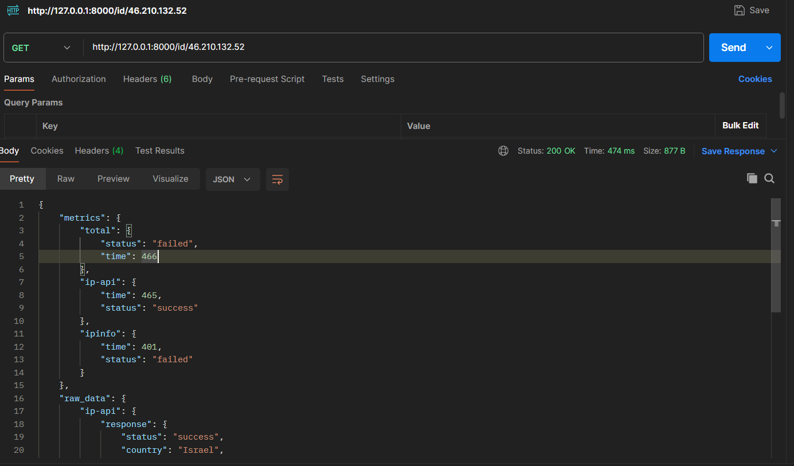
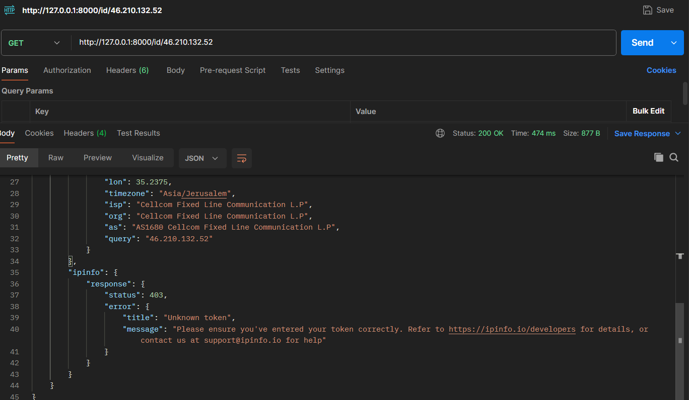
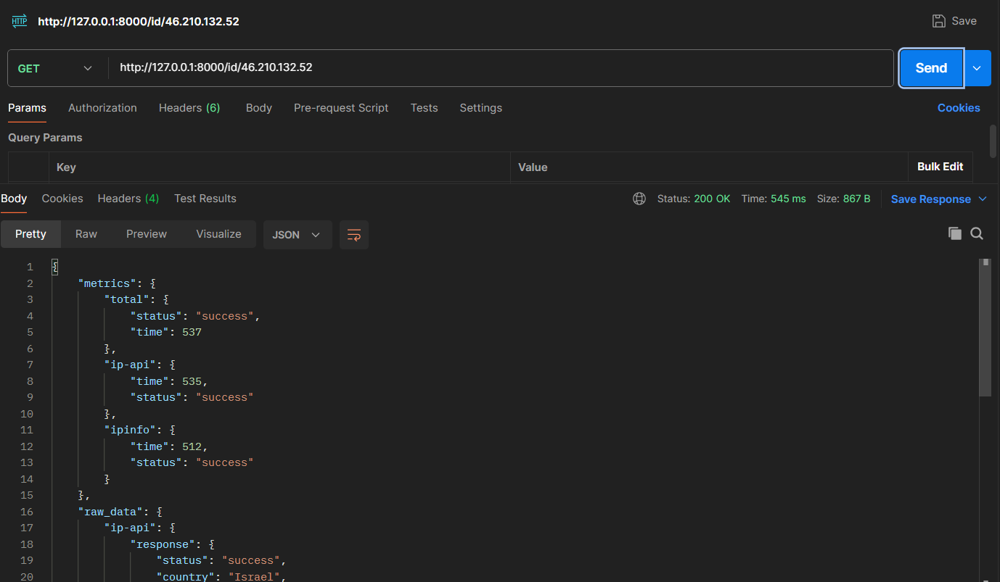
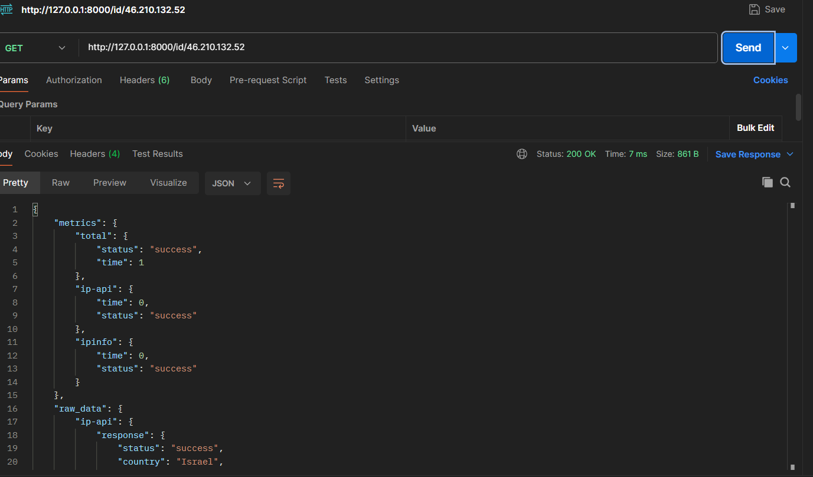

# IP Scraper

## Overview
Design and implement a system performing very basic OSINT (Open Source Intelligence) on a given IP Address. This system accepts an IP Address as input, fetches data from multiple online APIs, and aggregates the responses into a single JSON response.

## How to Run
```bash
uvicorn main:app --reload
```

## Specifications
- [ ] The system exposes an HTTP API that accepts a single IP Address as input.
- [ ] The system returns an HTTP response with JSON data in the body.
- [ ] Response JSON consists of two parts:
    - **Raw data**: Responses as fetched from the sources.
    - **Metrics**: Execution time for each source.
- [ ] The system caches responses for 10 seconds.

### External APIs
- **ip-api**: [https://ip-api.com/docs/api:json](https://ip-api.com/docs/api:json)
- **ipinfo**: [https://ipinfo.io/developers/ipinfo-api](https://ipinfo.io/developers/ipinfo-api)

## Implementation Details
Implement a component that queries the 2 APIs following the specs.

### Example
**Input Request:**
`http://127.0.0.1/176.228.193.161`

**Internal Logic:**
Query `http://ip-api.com/json/176.228.193.161` (and the other API).

### Tips
- **Metrics**: In the total section, if one fails, all fail.
- **Cache**: Must support 10 seconds expiration (fast and efficient).
- **Scalability**: Build for scale (currently 2 APIs, but potentially many more in the future).

### Key Requirements
- [ ] Correct Output
- [ ] Caching

## Output Example
```json
{
  "metrics": {
    "ip-api": {
      "status": "success",
      "time": "1"
    },
    "bgview": {
      "status": "success",
      "time": "2"
    },
    "total": {
      "status": "success",
      "time": "2"
    }
  },
  "raw_data": {
    "ip-api": {
      "response": "hello world"
    },
    "bgview": {
      "response": "hello world"
    }
  }
}
```

## Screenshots
### Works on Fail



### Works on Success


### Cache Works

